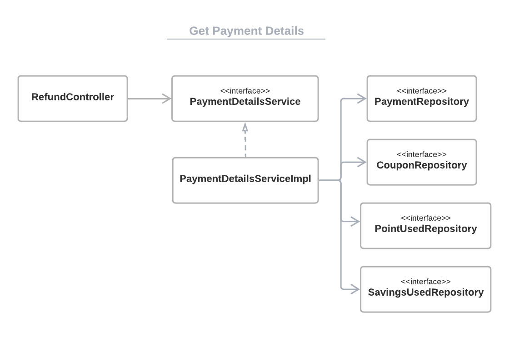

buy-something
==============
쇼핑몰 상품 주문 서비스 입니다. 

 

# 범위      
본 과제에서는 쇼핑몰 상품 주문 프로세스를 구현합니다. 제공하는 API는 크게 두 가지로 분류됩니다.

* 주문 및 결제를 위한 API
  * getUserInfo: 사용자가 가진 결제수단(적립금, 쿠폰, 포인트)을 불러온다.
  * getSelection: 자동으로 결제수단을 선택한다.
  * makePayment: 결제를 요청한다.

* 환불을 위한 API
  * getPaymentHistory: 사용자의 결제 이력을 불러온다.
  * getPaymentDetails: 특정 결제내역을 상세조회한다.
  * giveRefund: 환불요청을 처리한다.

 

# 클래스 다이어그램

## 주문 프로세스
주문과 관련한 요청은 OrderController에서 처리합니다.               

### Get User Information
클라이언트가 "/order"를 요청하면 OrderController는 UserInfoService를 통해 사용자 정보를 받아와 이를 반환합니다.                   

 

 

### Get Auto Selected Result
클라이언트가 "/order/{userId}/auto-select"를 요청하면 OrderController는 AutoSelectService를 통해 자동선택된 결제수단 정보를 받아와 이를 반환합니다.                        

                

 

### Make Payment          
클라이언트가 "/order/make-payment"를 요청하면 OrderController는 MakePaymentService를 통해 결제요청을 처리합니다.                          

                       

 
 

## 환불 프로세스
환불과 관련한 요청은 RefundController에서 처리합니다.               

### Get User Payment History
클라이언트가 "/history/{userId}"를 요청하면 RefundController는 PaymentHistoryService를 통해 사용자의 결제이력 정보를 받아와 이를 반환합니다.                   

 

 

### Get Payment Details
클라이언트가 "/history/{userId}/{paymentId}"를 요청하면 RefundController는 PaymentDetailsService를 통해 요청된 결제내역의 상세정보를 받아와 이를 반환합니다.                        

                

 

### Make Refund          
클라이언트가 "/refund/{paymentId}"를 요청하면 RefundController는 MakeRefundService를 통해 환불요청을 처리합니다.                          

                       

 

# 테이블 구조

                   

### user: 회원 정보 테이블

| 순서 | 한글항목명 | 영문항목명 | 속성 | 길이 | NULL | KEY | DEFAULT |
| :--: | :--------: | :-------: | :--: | :--: | :--: | :-: | :-----: | 
| 1 | ID | user_id | INT | 11 | NOTNULL | PK | AUTO_INCREMENT |
| 2 | 사용자이름 | user_name | VARCHAR | 50 | NOTNULL | | | 

 

### savings: 적립금 정보 테이블

| 순서 | 한글항목명 | 영문항목명 | 속성 | 길이 | NULL | KEY | DEFAULT | 
| :--: | :--------: | :-------: | :--: | :--: | :--: | :-: | :-----: | 
| 1 | ID | savings_id | INT | 11 | NOTNULL | PK | AUTO_INCREMENT |
| 2 | 사용자ID | user_id | INT | 11 | NOTNULL | FK | | 
| 3 | 가용적립금 | amount | INT | 11 | NOTNULL | | | 

 

### point: 포인트 정보 테이블

| 순서 | 한글항목명 | 영문항목명 | 속성 | 길이 | NULL | KEY | DEFAULT | 
| :--: | :--------: | :-------: | :--: | :--: | :--: | :-: | :-----: | 
| 1 | ID | point_id | INT | 11 | NOTNULL | PK | AUTO_INCREMENT |
| 2 | 사용자ID | user_id | INT | 11 | NOTNULL | FK | | 
| 3 | 가용포인트 | amount | INT | 11 | NOTNULL | | |
| 4 | 만료일 | expiry_date | DATE | | | | NULL |

 

### coupon: 쿠폰 정보 테이블

| 순서 | 한글항목명 | 영문항목명 | 속성 | 길이 | NULL | KEY | DEFAULT | 
| :--: | :--------: | :-------: | :--: | :--: | :--: | :-: | :-----: | 
| 1 | ID | coupon_id | INT | 11 | NOTNULL | PK | AUTO_INCREMENT |
| 2 | 사용자ID | user_id | INT | 11 | NOTNULL | FK | |
| 3 | 결제ID | payment_id | INT | 11 | | | NULL |
| 4 | 사용여부 | expired | TINYINT | 4 | NOTNULL | | 0 |
| 5 | 쿠폰종류 | coupon_type | INT | 11 | NOTNULL | | |

 

### payment: 결제 정보 테이블

| 순서 | 한글항목명 | 영문항목명 | 속성 | 길이 | NULL | KEY | DEFAULT | 
| :--: | :--------: | :-------: | :--: | :--: | :--: | :-: | :-----: | 
| 1 | ID | payment_id | INT | 11 | NOTNULL | PK | AUTO_INCREMENT |
| 2 | 사용자ID | user_id | INT | 11 | NOTNULL | FK | | 
| 3 | 주문금액 | cart_amount | INT | 11 | NOTNULL | | | 
| 4 | 결제일자 | purchase_date | DATETIME | | NOTNULL | | |
| 5 | 환불여부 | refunded | TINYINT | 4 | NOTNULL | | 0 |

 

### savings_used: 사용한 적립금 정보 테이블

| 순서 | 한글항목명 | 영문항목명 | 속성 | 길이 | NULL | KEY | DEFAULT | 
| :--: | :--------: | :-------: | :--: | :--: | :--: | :-: | :-----: | 
| 1 | ID | id | INT | 11 | NOTNULL | PK | AUTO_INCREMENT |
| 2 | 결제ID | payment_id | INT | 11 | NOTNULL | FK | | 
| 3 | 사용적립금 | amount | INT | 11 | NOTNULL | | |

 

### point_used: 사용한 포인트 정보 테이블

| 순서 | 한글항목명 | 영문항목명 | 속성 | 길이 | NULL | KEY | DEFAULT | 
| :--: | :--------: | :-------: | :--: | :--: | :--: | :-: | :-----: | 
| 1 | ID | id | INT | 11 | NOTNULL | PK | AUTO_INCREMENT |
| 2 | 결제ID | payment_id | INT | 11 | NOTNULL | FK | | 
| 3 | 포인트ID | point_id | INT | 11 | NOTNULL | FK | |
| 4 | 사용포인트 | amount | INT | 11 | NOTNULL | | | 

 
